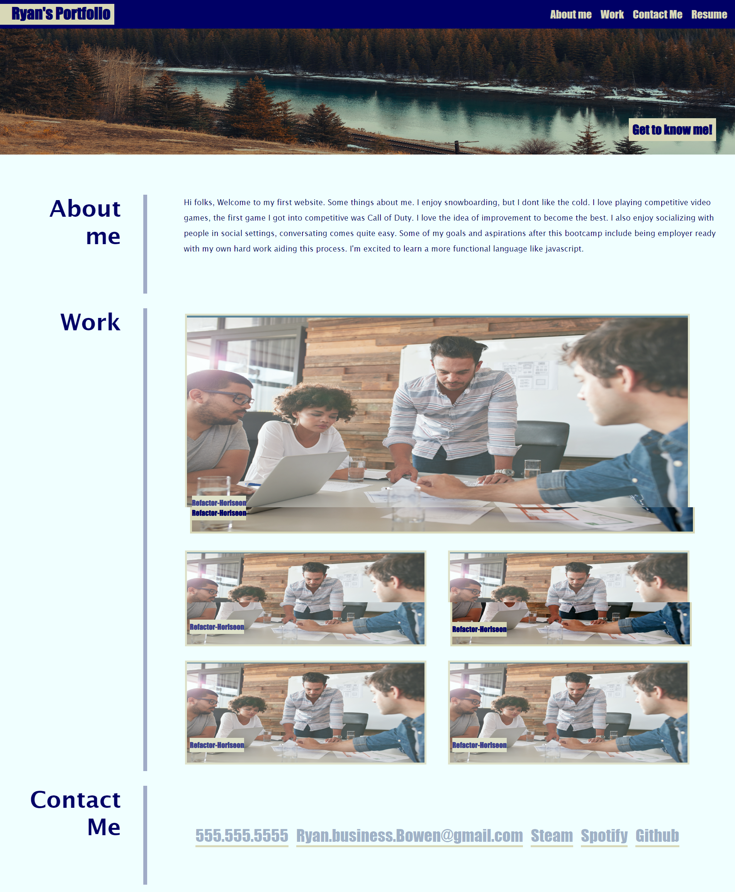

# Advanced-CSS-Portfolio

## Description

My motivation for this project was to make my first website from scratch. I built this for future me to see how much I progress in my coding journey. This solves an experience issue with myself and an issue with not having my very own website. I learned a lot about flexbox, the importance of having semantic and clean html code, also I'm learning constantly on different ways to establish new layouts with all the properties of CSS and some in HTML.

## Table of Contents (Optional)

If your README is long, add a table of contents to make it easy for users to find what they need.

- [Installation](#installation)
- [Usage](#usage)
- [Credits](#credits)
- [License](#license)

## Installation

What are the steps required to install your project? Provide a step-by-step description of how to get the development environment running.

## Usage
    

## Credits

I used tutoring and the instructor for some nuanced help. Other than those fantastic people it was all me!

## License

N/A

🏆 The previous sections are the bare minimum, and your project will ultimately determine the content of this document. You might also want to consider adding the following sections.

## Badges

Badges aren't necessary, per se, but they demonstrate street cred. Badges let other developers know that you know what you're doing. Check out the badges hosted by [shields.io](https://shields.io/). You may not understand what they all represent now, but you will in time.

## Features

If your project has a lot of features, list them here.

## How to Contribute

Ryan.business.bowen@gmail.com

## Tests

N/A